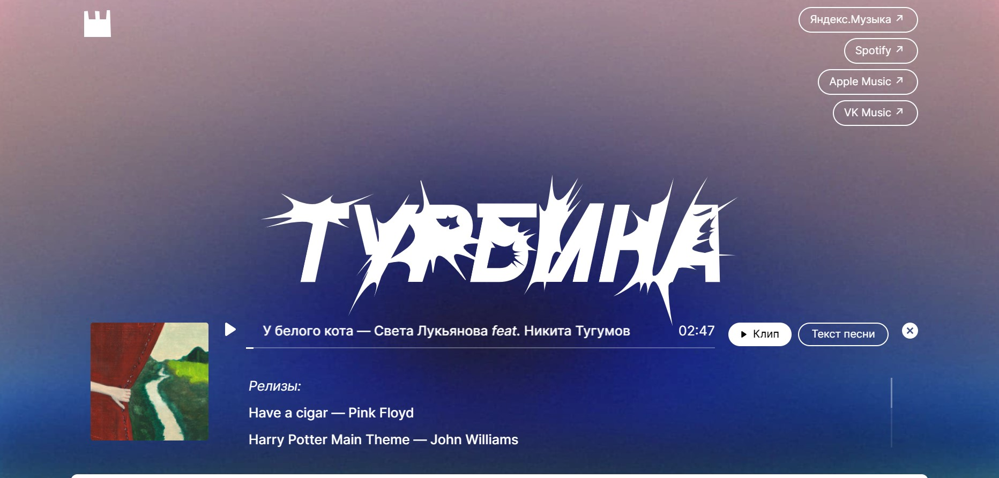
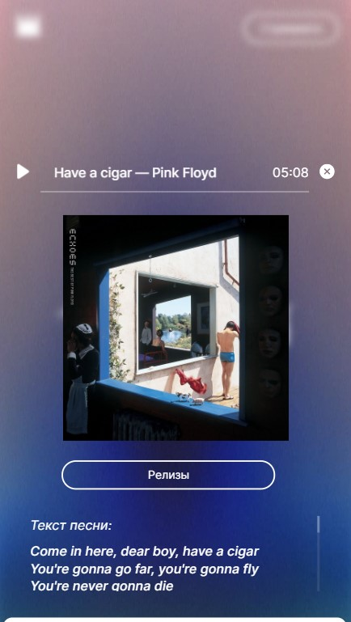

# Turbina React Music Player

Turbina is a voluntary promotion project for the children's bookshop [Marshak](https://marshakbooks.ru/). It's a React web application with a music player and a feedback form. All the functionality of the project works in popular browsers and on modern devices. It has adaptive layout for different resolutions.

The feedback form allows users to join the project and share their children's poems. In collaboration with modern bands these poems are turned into music tracks. Input fields collect data and send it to the server for further processing. Also user-friendly validation is configured.

---

## :mag_right: Preview




---

## :link: GitPages link

[GitPages](https://dianadomino24.github.io/turbina-dd/)

---

## :arrow_down: How to install and test

1. Clone the repository:

```
git clone https://github.com/dianadomino24/turbina-dd.git
```

2. Install dependencies:

```
npm install
```

3. Available modes:

```
    * development mode:

      npm run start

    * creating a production version of the app:

      npm run build
```

---

## :rocket: Technologies

- **JavaScript ES6** - object-oriented programming, fetch API,

- semantic **HTML5**, styles - **CSS3** including Flexbox, Grid, adaptive layout,
- **jsx**,
- **BEM** methodology,

- **React.js** - functional and class components, Ref functions,
- **React hooks** - useState, useEffect, useRef,
- **Create React App** build,
- React Validation,

- **ESLint**,
- **Figma**, **Pixel perfect**,

- **Git** versions, branches, team work, peer code reviews.

---

**Practicum by Yandex** - https://practicum.yandex.com/

## :sparkles: Thanks for watching! :sparkles:
